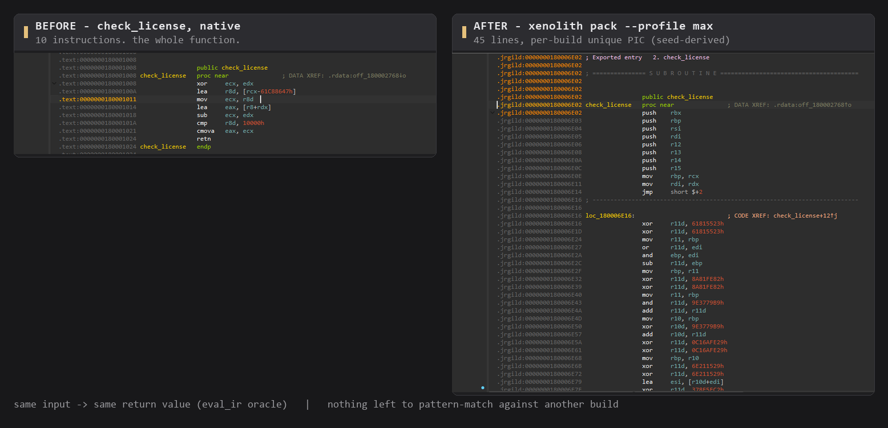

# Xenolith

<p align="center">
  
</p>

<h3 align="center">Open-source native packer: your functions, compiled into code that exists only in that build</h3>

<p align="center">
  <b>English</b> | <a href="README.zh-CN.md">中文文档</a> |
  <a href="https://github.com/HHT0rro/Xenolith/releases">Download</a> |
  <a href="docs/THREAT-MODEL.md">Threat model</a> |
  <a href="docs/WHITEBOX.md">White-box model</a>
</p>

**Xenolith is a post-link binary protector for Windows x86-64 PE64 (experimental Linux AMD64 ELF64).** Give it a compiled binary — no source code, no recompilation — and it compiles the functions you select into position-independent native code that exists only in that one build. The protected image contains **no guest bytecode, no reusable opcode table, no central dispatcher**. Payload is sealed with per-page ChaCha20-Poly1305 and unsealed at load time by an injected PIC boot stub plus a freestanding C core.

<p align="center">
  
</p>

## Why another packer

Commercial virtualizers — VMProtect, Themida — protect code by interpreting guest bytecode on a shared handler table. [NoVmp](https://github.com/can1357/NoVmp) showed that this structure can be statically lifted back to IR *without the packer's source*: learn the VM once, amortize the cost across every sample it ever packed.

Xenolith refuses that architecture. "Virtualization" here is a **pack-time compiler**, not a runtime interpreter:

- **Selected exports become unique native code.** Each chosen function is lifted to an internal IR (never written to the image), then every basic block is emitted as a *superoperator* — position-independent x64 with per-block register allocation, scheduling, MBA rewrites and opaque edges, all derived from a per-build 16-byte seed. Blocks connect by direct `jmp`/`jcc`.
- **Nothing reusable across builds.** Two builds of the same function do not collapse to the same mnemonic/register histogram (`G-WB-DIVERSE`), and no opcode→semantics mapping survives between builds (`G-WB-META`). An attacker cannot train on one sample and generalize.
- **Tamper fails closed.** Pages are ChaCha20-Poly1305 regions whose AAD binds platform, profile, region index, RVA and length. The runtime key is rebuilt from MBA key shares ⊕ a SHA-256 measurement of the whole image: flip one mapped byte and the image refuses to load (`G-TAMPER`).

The trade-off is stated, not hidden: protection cost grows with the block count of each selected function. In exchange, "learn the VM once" stops working — every protected build is a new program.

## What it is, what it is not

**Is** — a standalone packer. `pack` consumes PE64/ELF64 and emits `.xl.dll` / `.xl.exe` / `.xl.so` / `.xl.elf`. The thing that actually runs on the target system is an injected PIC boot stub plus a freestanding `xl_core` (no CRT, no imports, no globals). `--vm-export` virtualizes the named exports you pick; CRT code and `DllMain` always stay native.

**Is not** — full `.text` virtualization, and not a VMProtect-style shared-ISA clone. In the default profiles (W1/W2) strength is roughly at the OLLVM band: mutated x64 is still readable and the CFG remains isomorphic to the original. The qualitative jump starts at W3 (`--trace-diverge`): identical input, identical return value, per-process divergent instruction streams. Irreversibility and "unbreakable" are *not* claims this project makes.

**Honest boundary** — under the white-box threat model (W0) the attacker owns this repository, professional tooling, and unlimited AI assistance; they can pack their own training samples. "A custom ISA not in LLM training data" is therefore **not** a security claim this project makes. The real W0 goal: there is no general `xenolith-devirt` — cost must grow with the number of protected functions, not with "learned the VM once".

Unsupported inputs and unwired switches fail closed: the packer refuses, it does not silently degrade.

## Quick start

**Download** the prebuilt Windows CLI from [Releases](https://github.com/HHT0rro/Xenolith/releases) (sha256 in the release bundle), or build from source:

```console
cargo build --release -p xenolith-cli
cargo build -p license-toy --release

cargo run --release -p xenolith-cli -- pack target/release/license_toy.dll ^
      -o target/release/license_toy.xl.dll --profile max --vm-export check_license

cargo run --release -p xenolith-cli -- inspect target/release/license_toy.xl.dll --json
```

The packed DLL still exports `check_license`, but its body now lives inside the stub as per-block PIC. `xenolith` with no arguments opens a four-screen TUI (Pick → Configure → Packing → Result). To verify trampolines and semantics end-to-end, run the strength-gate suite `scripts/ci-gates.ps1`.

## Architecture at a glance

| Crate | Responsibility |
| --- | --- |
| `xenolith-formats` | fail-closed PE64 + ELF64 AMD64 parser |
| `xenolith-crypto` | MBA key shares, ChaCha20-Poly1305 AEAD, page MACs, hashed imports |
| `xenolith-protocol` | EnvelopeV2 (`XLV2`) on-disk layout, AAD binding, fail-closed parsing |
| `xenolith-pack` | lift, superoperator pipeline, EnvelopeV2 writer, PIC stub embedding |
| `xenolith-vm` | stub key-mix VM, pack-time IR, `eval_ir` semantic oracle, superop/MBA codegen |
| `xenolith-guard` | pack-time anti-debug / anti-dump *policy*; syscalls live in the PIC stub |
| `xenolith-cli` | CLI, project files, TUI |

Load-time flow (Windows): system loader → PIC stub boot (PEB walk, resolves `LoadLibrary`/`GetProcAddress`/`VirtualProtect`) → `xl_core` authenticated per-page decryption (RW→RX, no long-lived RWX) → hashed imports resolved and written back to the original IAT slots → keyed FNV page digests verify → stolen OEP bytes restored → jump to original entry. ASLR/DEP/CFG/CET, TLS callbacks and exception unwinding (`.pdata`/XDATA; C++ exceptions, `setjmp/longjmp`, varargs, struct returns verified on packed images) all keep working.

On Linux the loader stays `ld.so`: Xenolith appends one R+X `PT_LOAD` and redirects `INIT_ARRAY[0]`; PIE/RELRO/GOT-PLT untouched. Verified on Ubuntu 24.04 (WSL): packed executables run, `.so` files survive `dlopen`/`dlclose`, symbol versioning and IFUNC resolvers work.

## How it compares

| | When | Needs source | Core structure | Public auto-unpacking | License |
| --- | --- | --- | --- | --- | --- |
| UPX | post-link | no | compression + small restore stub | `upx -d`, by design | GPL-2.0+, output exception |
| OLLVM family | compile-time | yes | IR-level substitution / flattening / BCF | flattening recoverable via symbolic execution (published) | open source, varies |
| Tigress | source-to-source | yes (C) | function virtualization, data encoding | research tools, no generic unpacker | research-only, not OSI |
| VMProtect | post-link | no | shared handler table + guest bytecode | NoVmp lifts x64 3.0–3.5 to VTIL | commercial |
| Themida | post-link | no | multi-VM skeletons + per-build mutation, still handler table + bytecode | "find dispatcher, classify handlers" is a mature loop | commercial |
| **Xenolith** | post-link | no | per-block unique PIC superoperators; no dispatcher, no bytecode | goal: make generic lifters non-reusable (W0), not irreversibility | GPL-3.0 + stub exception |

Key differences, spelled out: Xenolith keeps the CFG isomorphic and spends its diversity budget *inside* blocks (per-block register allocation, scheduling, MBA rewrites, seed-driven junk), where OLLVM flattening spends it on a central state-variable dispatcher. Where VMProtect's shared handler table is the reusable target, Xenolith's per-build superoperators are not a table at all. And unlike UPX, output is not meant to be unpackable: sections are ChaCha20-Poly1305 ciphertext over `0xCC` trap pages, with randomized section names and mutated stubs.

Full write-ups: [UPX](README.zh-CN.md#与其他加壳器的思路对比) · OLLVM · VMProtect/Themida · Tigress/M-oVfuscator — see [docs/TECHNIQUES.md](docs/TECHNIQUES.md) and [docs/WHITEBOX.md](docs/WHITEBOX.md).

## Verified strength gates

This is the complete list of strength claims — nothing stronger is claimed anywhere. Runner: `scripts/ci-gates.ps1`.

| ID | Attack | Pass criterion |
| --- | --- | --- |
| G-UPX | `upx -d` | fails |
| G-SIG | UPX/Themida/VMP section names & `UPX!`/`.packed` strings | best-effort scan hits nothing |
| G-KEY | contiguous 32-byte master key, searchable KDF | envelope stays closed |
| G-IAT | on-disk import directory | RVA = 0 under `standard`/`max`; stub writes resolved VAs back to original IAT slots |
| G-OEP | entry trace | packed entry is the PIC stub, not the original OEP |
| G-DUMP | MiniDump / full-image dump | **partial**: garbage section table + lied `SizeOfImage`; unpacked executable pages remain plaintext (C2 re-encryption not wired) |
| G-TAMPER | flip one mapped byte | `LoadLibrary` fails closed (keyed FNV page digests) |
| G-BEH | export semantics | `hello_add(3,4)=7`; `check_license` matches the `eval_ir` oracle |
| G-POLY | pack twice | different output files |
| G-WB-NOLIFT | decode guest bytecode from packed PIC | fails; no guest `movzx/inc/cmp/je` tuple in the stub |
| G-WB-DIVERSE | two seeds | mnemonic/register histograms do not collapse |
| G-WB-TRACE | `--trace-diverge`, two processes | same `eax`; instruction-stream hash *may* differ |
| G-WB-META | two builds | no cross-build reusable opcode→semantics table |
| G-VM | selected exports | trampoline enters stub PIC |

**Known residuals** (also in the docs, not swept under the rug): unpacked executable pages stay plaintext in memory; Scylla-style IAT write-breakpoints within the unpack window still apply; a paused process can read the current page. The `max` profile adds PEB probe, `HideFromDebugger`, debug-port/object/flags checks, and pre-`NtQuery` INT3 traps — CI does not claim to beat attached debuggers, Frida, or RPM.

## CLI

```console
xenolith                              # no args → TUI
xenolith pack IN -o OUT [--profile fast|standard|max] [--vm-export a,b]
                                      [--trace-diverge] [--select-rva RVA:LEN]...
                                      [--select-function name|fn_0xADDR]... [--select-all]
                                      [--strict-coverage | --allow-native-fallback]
                                      [--seed-hex 64HEX] [--project FILE] [--json]
xenolith inspect IN [--json] [--exports]
xenolith project init IN -o FILE [--profile P] [--vm-export N ...]
```

- **Selection**: named exports, explicit RVA windows, symbol/`.pdata`-resolved functions, or explicit `--select-all`. The lift window is 256 bytes per block; 64-bit data, indirect calls, function pointers, recursion and jump tables fail closed (report as `mixed_native` only with `--allow-native-fallback`). JNI entry points (`JNI_OnLoad`, `Java_*`) are refused before any existence check — the JVM calls them by exact name.
- **Profiles**: `fast` = mutation + sharded payload encryption; `standard` = + hashed IAT, stolen entry bytes, keyed FNV; `max` = + page windows, dump interference, stub VM, runtime probes.
- **Project files**: `xenolith project init` writes, `pack --project` reads; schema v2 with a known-key whitelist and **fail-closed on unknown keys** — a future `c2: true` cannot masquerade as implemented.
- **Reproducibility**: `--seed-hex` exists only to reproduce G-POLY experiments; the seed is never printed in reports.

## Build & test

```console
cargo build --release -p xenolith-cli
cargo build -p hello-dll --release
cargo build -p license-toy --release
cargo test --workspace --exclude xenolith-runtime
```

`xenolith-runtime` is excluded because it is a `no_std` `#[panic_handler]` crate that workspace feature unification would pollute with `std` (E0152). Packing tests require the sample DLLs — missing samples fail the test, they are not skipped. Distribution build: `powershell -ExecutionPolicy Bypass -File scripts/build-exe.ps1` produces `dist/xenolith.exe` + sha256 (`-ReleaseBundle` adds SBOM, provenance and the performance-budget gate).

## License

**GPL-3.0-or-later + Stub Exception** (full text at the end of [LICENSE](LICENSE)): the packer itself is GPL software, but **the packed program** — your binary plus everything Xenolith injects into it — may be distributed under any terms you choose. Copyleft stops at the tool and does not reach its output, the same design as UPX's output exception and the GCC Runtime Library Exception. Two conditions: the corresponding Xenolith source stays available under GPL-3.0-or-later, and the exception covers only the injected stub/loader/VM combined with your program — not Xenolith itself.

 GPLv3 §3 also means this project is not a "technological protection measure" in the anti-circumvention sense: every strength claim here is an engineering claim, not a legal one.

## Documentation

[SUPPORT](docs/SUPPORT.md) (current support matrix vs. production targets) · [THREAT-MODEL](docs/THREAT-MODEL.md) · [WHITEBOX](docs/WHITEBOX.md) (white-box tiers for export virtualization) · [ENTROPY](docs/ENTROPY.md) (W3 coin & residual risks) · [TECHNIQUES](docs/TECHNIQUES.md) · [POLICY](docs/POLICY.md) · [中文文档](README.zh-CN.md)

## Non-goals

- Full `.text` / CRT / `DllMain` virtualization
- Cloning VMProtect/Themida's shared handler-table ISA (a white-box regression per [docs/WHITEBOX.md](docs/WHITEBOX.md))
- Commercial-packer parity, irreversibility, "infinite-AI attacks fail" claims
- Killing/injecting other processes, patching on-disk ntdll, fighting EDRs
- macOS, ARM, .NET mixed-mode, kernel drivers
- Treating `xenolith-loader`/`xenolith-runtime` as the packed image's runtime
